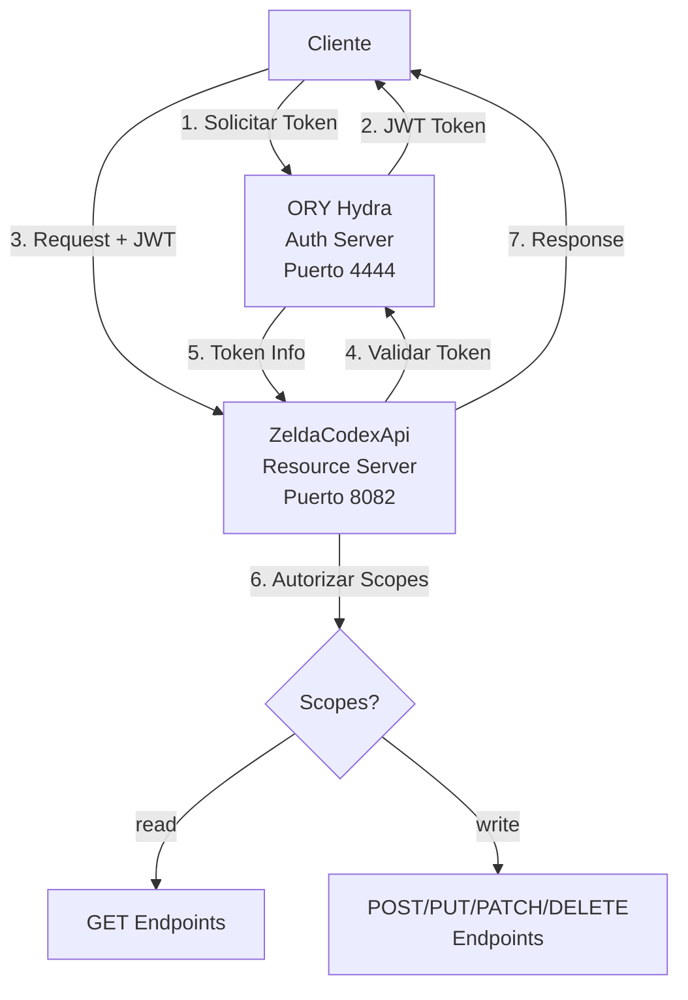

# Autenticación y Autorización - OAuth 2.0 con ORY Hydra

## 📋 Descripción General

La **ZeldaCodexApi** implementa autenticación y autorización basada en **OAuth 2.0** utilizando **ORY Hydra** como servidor de autorización. El sistema maneja dos niveles de permisos: `read` (lectura) y `write` (escritura).

## 🏗️ Arquitectura de Seguridad



## 🔐 Componentes de Seguridad

### 1. **ORY Hydra** - Authorization Server
- **Puerto Público**: 4444 (Token endpoint, JWKS, etc.)
- **Puerto Admin**: 4445 (Gestión de clientes)
- **Base de Datos**: PostgreSQL (tabla `hydra_db`)
- **Algoritmo**: RS256 JWT con rotación de claves

### 2. **ZeldaCodexApi** - Resource Server
- **Validación JWT**: Automática con Spring Security OAuth2
- **Scopes**: `read` y `write`
- **Autorización**: Method-level y endpoint-level

## 🎯 Scopes y Permisos

| Scope | Descripción | Endpoints Permitidos |
|-------|-------------|---------------------|
| `read` | Solo lectura | `GET /api/v1/weapons/*`, `GET /api/v1/cache/info` |
| `write` | Escritura completa | `POST`, `PUT`, `PATCH`, `DELETE /api/v1/weapons/*` |
| `admin` | Administración | Todos los endpoints + gestión de cache |

### Mapeo de Endpoints

```java
// ✅ Públicos (sin autenticación)
GET /api/v1                    // Información de la API
GET /swagger-ui.html           // Documentación Swagger
GET /actuator/health           // Health check

// 🔓 Requieren scope 'read'
GET /api/v1/weapons           // Listar armas
GET /api/v1/weapons/{id}      // Obtener arma específica
GET /api/v1/cache/info        // Estado del cache

// 🔒 Requieren scope 'write'  
POST /api/v1/weapons          // Crear arma
PUT /api/v1/weapons/{id}      // Reemplazar arma
PATCH /api/v1/weapons/{id}    // Actualizar arma parcialmente
DELETE /api/v1/weapons/{id}   // Eliminar arma
DELETE /cache/clear           // Limpiar cache
```

## 👥 Clientes OAuth2 Configurados

### 1. **Cliente General** (`zelda-api-client`)
```json
{
  "client_id": "zelda-api-client",
  "client_secret": "zelda-api-secret-2024",
  "scopes": ["read", "write"],
  "grant_types": ["client_credentials", "authorization_code"],
  "description": "Cliente para aplicaciones generales"
}
```

### 2. **Cliente Solo Lectura** (`zelda-readonly-client`)
```json
{
  "client_id": "zelda-readonly-client", 
  "client_secret": "readonly-secret-2024",
  "scopes": ["read"],
  "grant_types": ["client_credentials"],
  "description": "Cliente para consultas únicamente"
}
```

### 3. **Cliente Administrativo** (`zelda-admin-client`)
```json
{
  "client_id": "zelda-admin-client",
  "client_secret": "admin-secret-2024", 
  "scopes": ["read", "write", "admin"],
  "grant_types": ["client_credentials", "authorization_code"],
  "description": "Cliente con permisos administrativos completos"
}
```

## 🚀 Setup y Configuración

### 1. **Iniciar Stack Completo**

```bash
# Iniciar todos los servicios
docker-compose up -d

# Verificar que Hydra esté funcionando
curl http://localhost:4445/health/ready
curl http://localhost:4444/.well-known/openid_configuration
```

### 2. **Configurar Clientes OAuth2**

```bash
# Ejecutar script de configuración
chmod +x setup-oauth-clients.sh
./setup-oauth-clients.sh

# O configurar manualmente
curl -X POST http://localhost:4445/admin/clients \
  -H "Content-Type: application/json" \
  -d '{
    "client_id": "my-client",
    "client_secret": "my-secret", 
    "grant_types": ["client_credentials"],
    "scope": "read write"
  }'
```

### 3. **Verificar Configuración**

```bash
# Listar clientes configurados
curl http://localhost:4445/admin/clients

# Verificar configuración OpenID
curl http://localhost:4444/.well-known/openid_configuration
```

## 🔑 Flujos de Autenticación

### 1. **Client Credentials Flow** (Recomendado para APIs)

```bash
# Obtener token con scope 'read'
curl -X POST http://localhost:4444/oauth2/token \
  -H "Content-Type: application/x-www-form-urlencoded" \
  -d "grant_type=client_credentials&scope=read" \
  -u "zelda-readonly-client:readonly-secret-2024"

# Respuesta esperada:
{
  "access_token": "eyJhbGciOiJSUzI1NiIsInR5cCI6IkpXVCJ9...",
  "expires_in": 3600,
  "scope": "read", 
  "token_type": "Bearer"
}
```

### 2. **Authorization Code Flow** (Para aplicaciones web)

```bash
# 1. Redirigir usuario a Hydra para autorización
http://localhost:4444/oauth2/auth?client_id=zelda-api-client&response_type=code&scope=read+write&redirect_uri=http://localhost:8082/auth/callback

# 2. Hydra redirige con código
# 3. Intercambiar código por token
curl -X POST http://localhost:4444/oauth2/token \
  -H "Content-Type: application/x-www-form-urlencoded" \
  -d "grant_type=authorization_code&code=AUTHORIZATION_CODE&redirect_uri=http://localhost:8082/auth/callback" \
  -u "zelda-api-client:zelda-api-secret-2024"
```

## 🧪 Testing de Autenticación

### 1. **Sin Token** (Debe fallar con 401)

```bash
curl -v http://localhost:8082/api/v1/weapons
# HTTP/1.1 401 Unauthorized
```

### 2. **Con Token de Solo Lectura**

```bash
# Obtener token read-only
TOKEN=$(curl -s -X POST http://localhost:4444/oauth2/token \
  -H "Content-Type: application/x-www-form-urlencoded" \
  -d "grant_type=client_credentials&scope=read" \
  -u "zelda-readonly-client:readonly-secret-2024" | jq -r .access_token)

# Usar token para consulta (✅ Debe funcionar)
curl -H "Authorization: Bearer $TOKEN" \
  http://localhost:8082/api/v1/weapons

# Intentar crear arma (❌ Debe fallar con 403)
curl -H "Authorization: Bearer $TOKEN" \
  -H "Content-Type: application/json" \
  -X POST http://localhost:8082/api/v1/weapons \
  -d '{"name":"Test Sword","weaponType":"ONE_HANDED_SWORD","damage":10,"durability":50,"element":"NONE"}'
# HTTP/1.1 403 Forbidden
```

### 3. **Con Token de Escritura**

```bash
# Obtener token con permisos de escritura
WRITE_TOKEN=$(curl -s -X POST http://localhost:4444/oauth2/token \
  -H "Content-Type: application/x-www-form-urlencoded" \
  -d "grant_type=client_credentials&scope=read write" \
  -u "zelda-api-client:zelda-api-secret-2024" | jq -r .access_token)

# Crear arma (✅ Debe funcionar)
curl -H "Authorization: Bearer $WRITE_TOKEN" \
  -H "Content-Type: application/json" \
  -X POST http://localhost:8082/api/v1/weapons \
  -d '{
    "name": "Master Sword",
    "weaponType": "ONE_HANDED_SWORD",
    "damage": 30,
    "durability": 200,
    "element": "NONE"
  }'
```

### 4. **Verificar Token Information**

```bash
# Ver información del token actual
curl -H "Authorization: Bearer $TOKEN" \
  http://localhost:8082/auth/info

# Ver scopes disponibles
curl -H "Authorization: Bearer $TOKEN" \
  http://localhost:8082/auth/scopes
```

## 🛡️ Configuración de Seguridad

### Spring Security Configuration

```java
@EnableWebSecurity
@EnableMethodSecurity(prePostEnabled = true)
public class SecurityConfig {
    
    // Configuración de endpoints públicos vs protegidos
    .authorizeHttpRequests(authz -> authz
        .requestMatchers("/actuator/health", "/swagger-ui/**").permitAll()
        .requestMatchers(HttpMethod.GET, "/api/v1/weapons/**").hasAuthority("SCOPE_read")
        .requestMatchers(HttpMethod.POST, "/api/v1/weapons/**").hasAuthority("SCOPE_write")
        // ...más configuración
    )
    
    // Configuración OAuth2 Resource Server
    .oauth2ResourceServer(oauth2 -> oauth2
        .jwt(jwt -> jwt.jwtAuthenticationConverter(jwtAuthenticationConverter()))
    )
}
```

### JWT Configuration

```properties
# Configuración del Resource Server
spring.security.oauth2.resourceserver.jwt.issuer-uri=http://localhost:4444/
spring.security.oauth2.resourceserver.jwt.jwk-set-uri=http://localhost:4444/.well-known/jwks.json

# Para Docker
spring.security.oauth2.resourceserver.jwt.issuer-uri=http://hydra:4444/
spring.security.oauth2.resourceserver.jwt.jwk-set-uri=http://hydra:4444/.well-known/jwks.json
```

## 📊 Swagger/OpenAPI con OAuth2

La documentación Swagger incluye autenticación OAuth2:

### Configuración

```java
@SecurityScheme(
    name = "oauth2",
    type = SecuritySchemeType.OAUTH2,
    flows = @OAuthFlows(
        clientCredentials = @OAuthFlow(
            tokenUrl = "http://localhost:4444/oauth2/token",
            scopes = {
                @OAuthScope(name = "read", description = "Permite leer información"),
                @OAuthScope(name = "write", description = "Permite modificar información")
            }
        )
    )
)
```

### Uso en Swagger UI

1. Ir a http://localhost:8082/swagger-ui.html
2. Hacer clic en **"Authorize"**
3. Configurar Client Credentials:
   - **Client ID**: `zelda-api-client`
   - **Client Secret**: `zelda-api-secret-2024`
   - **Scopes**: Seleccionar `read` y/o `write`
4. Hacer clic en **"Authorize"**
5. Probar endpoints directamente desde Swagger

## 🔍 Monitoreo y Debugging

### Logs Importantes

```bash
# Logs de autenticación en la API
docker-compose logs zelda-codex-api | grep -i "security\|oauth\|jwt"

# Logs de Hydra
docker-compose logs hydra

# Ver tokens activos (desde Hydra admin)
curl http://localhost:4445/admin/oauth2/introspect \
  -H "Content-Type: application/x-www-form-urlencoded" \
  -d "token=YOUR_ACCESS_TOKEN"
```

### Health Checks de Seguridad

```bash
# Verificar configuración OAuth2 en la API
curl http://localhost:8082/actuator/health

# Verificar Hydra
curl http://localhost:4445/health/ready
curl http://localhost:4444/.well-known/openid_configuration

# Verificar JWKS (claves públicas)
curl http://localhost:4444/.well-known/jwks.json
```

### Métricas de Autenticación

```bash
# Endpoint de información de autenticación
curl -H "Authorization: Bearer $TOKEN" \
  http://localhost:8082/auth/info

# Scopes y permisos del usuario actual
curl -H "Authorization: Bearer $TOKEN" \
  http://localhost:8082/auth/scopes
```

## 🚨 Troubleshooting

### Problemas Comunes

1. **401 Unauthorized**
   - Verificar que el token esté presente en el header `Authorization: Bearer TOKEN`
   - Verificar que el token no haya expirado
   - Verificar configuración de `issuer-uri` y `jwk-set-uri`

2. **403 Forbidden** 
   - Verificar que el token tenga el scope requerido
   - Verificar que el endpoint requiera el scope correcto

3. **Hydra no está disponible**
   - Verificar que PostgreSQL esté corriendo
   - Verificar logs de Hydra: `docker-compose logs hydra`
   - Verificar conexión de base de datos

4. **CORS Issues**
   - Verificar configuración CORS en SecurityConfig
   - Para desarrollo local, asegurar `allowCredentials(true)`

---

Este sistema de autenticación y autorización proporciona un control de acceso robusto y escalable, siguiendo estándares OAuth 2.0 y mejores prácticas de seguridad para APIs REST.