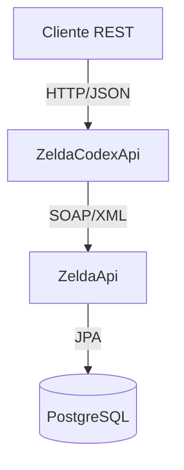

# Zelda Codex API

## 📖 Descripción

**Zelda Codex API** es un servicio REST que actúa como gateway para consultar el arsenal de armas de *The Legend of Zelda: Breath of the Wild*. Esta API consume el servicio SOAP **ZeldaApi** y proporciona una interfaz REST moderna con documentación Swagger.

## 🏗️ Arquitectura



- **ZeldaCodexApi** (REST) - Puerto 8082
- **ZeldaApi** (SOAP) - Puerto 8081  
- **PostgreSQL** - Puerto 5432

## ⚔️ Modelo de Datos

### Weapon (Arma)
- `id` (UUID) - Identificador único
- `name` (String) - Nombre del arma
- `weaponType` (WeaponType) - Tipo de arma
- `damage` (Integer) - Daño base
- `durability` (Integer) - Durabilidad
- `element` (Element) - Elemento opcional

### WeaponType (Tipo de Arma)
- BAT, BOOMERANG, CLUB, HAMMER, ROD, SPEAR
- ONE_HANDED_SWORD, TWO_HANDED_SWORD, OTHER

### Element (Elemento)
- FIRE, ICE, ELECTRIC

## 🚀 Endpoints REST

### GET /api/v1/weapons/{id}
Obtiene un arma por su ID.

**Respuesta 200:**
```json
{
  "id": "123e4567-e89b-12d3-a456-426614174000",
  "name": "Master Sword",
  "weaponType": "ONE_HANDED_SWORD",
  "damage": 30,
  "durability": 200,
  "element": null
}
```

### POST /api/v1/weapons
Crea una nueva arma.

**Request Body:**
```json
{
  "name": "Savage Lynel Sword",
  "weaponType": "ONE_HANDED_SWORD",
  "damage": 58,
  "durability": 41,
  "element": "FIRE"
}
```

### DELETE /api/v1/weapons/{id}
Elimina un arma por su ID.

## 🛠️ Tecnologías

- **Java 17**
- **Spring Boot 3.1.0**
- **Spring Web Services** (cliente SOAP)
- **Swagger/OpenAPI 3**
- **Jackson** (JSON)
- **Maven**
- **Docker**

## 📊 Patrones Implementados

- ✅ **Gateway Pattern** - Consume ZeldaApi (SOAP)
- ✅ **DTO Pattern** - Separación entre API y dominio
- ✅ **Mapper Pattern** - Conversión entre capas
- ✅ **Service Layer** - Lógica de negocio
- ✅ **Exception Handling** - Manejo centralizado de errores

## 🏃‍♂️ Ejecución

### Con Docker Compose
```bash
docker-compose up -d
```

### Desarrollo Local
```bash
# Compilar
mvn clean compile

# Ejecutar
mvn spring-boot:run
```

## 📚 Documentación

Una vez ejecutándose, accede a:
- **Swagger UI:** http://localhost:8082/swagger-ui.html
- **OpenAPI Docs:** http://localhost:8082/api-docs

## 🔗 Comparación con PokemonApp

| Característica | PokedexApi (C#) | ZeldaCodexApi (Java) |
|----------------|-----------------|----------------------|
| **Framework** | ASP.NET Core | Spring Boot |
| **Puerto** | 8082 | 8082 |
| **Protocolo** | REST → SOAP | REST → SOAP |
| **Autenticación** | JWT + Hydra | Sin autenticación |
| **Documentación** | Swagger | Swagger/OpenAPI |
| **Dominio** | Pokémon | Armas de Zelda |

## 🎯 Propósito

Esta API demuestra la implementación del **patrón Gateway** en Java/Spring Boot, replicando la arquitectura de **PokedexApi** pero adaptada al universo de *The Legend of Zelda: Breath of the Wild*. 

¡Perfecto para explorar el arsenal completo de Hyrule! ⚔️✨